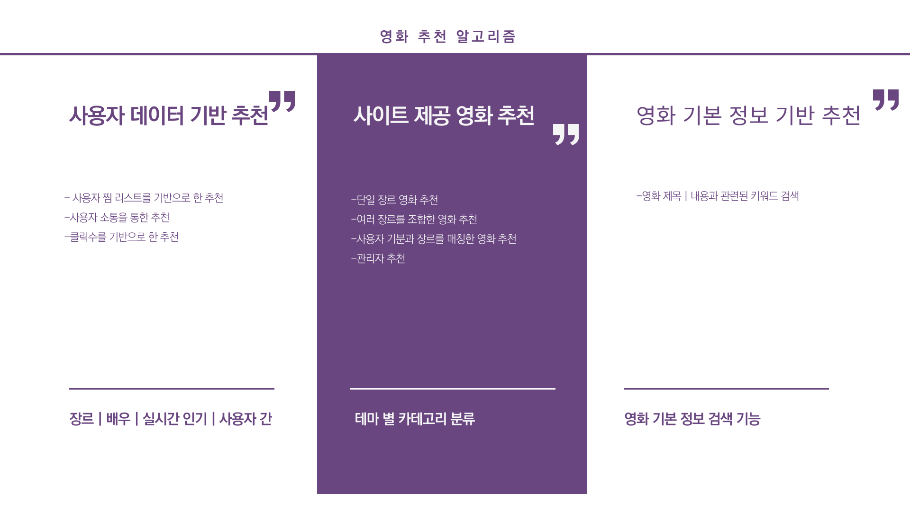
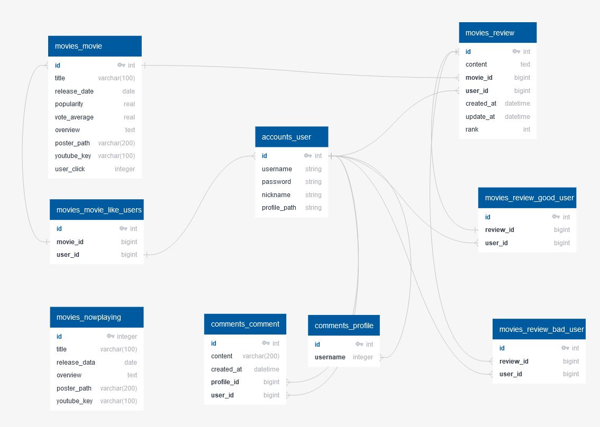

# 이:유

`이유있는 영화 추천 이:유`

[프로젝트 메모 및 공유 : Notion](https://rose-mushroom-2f9.notion.site/1791c848606e4b30a543c6bc34284f95)

# 1. 팀원 정보 및 업무 분담 내역

- 개발 기간: 2022.11.16 ~ 2022.11.25 (총 9일)
  공동  
  - 전체적인 틀 구성  
  - 노션 관리
- 이지은 / 류원창 
  - 백엔드(Django API Server. 영화 API를 활용한 Data Seeding, API 가이드) & 프론트엔드 담당(Bootstrap 5, Vue.js, UI   구현, 디자인)
   

# 2. 구현 할고리즘

# 3. 데이터 베이스 모델링 (ERD)

[ERD 보러가기](https://app.quickdatabasediagrams.com/#/d/7lRpZ6)

